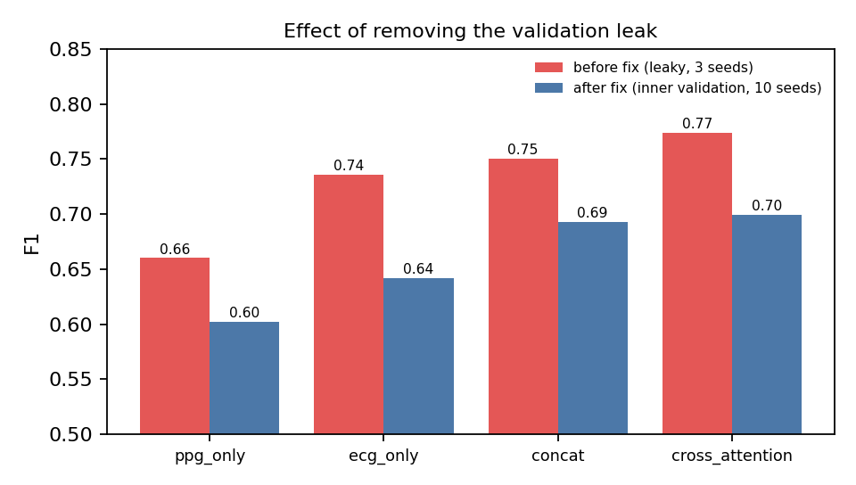
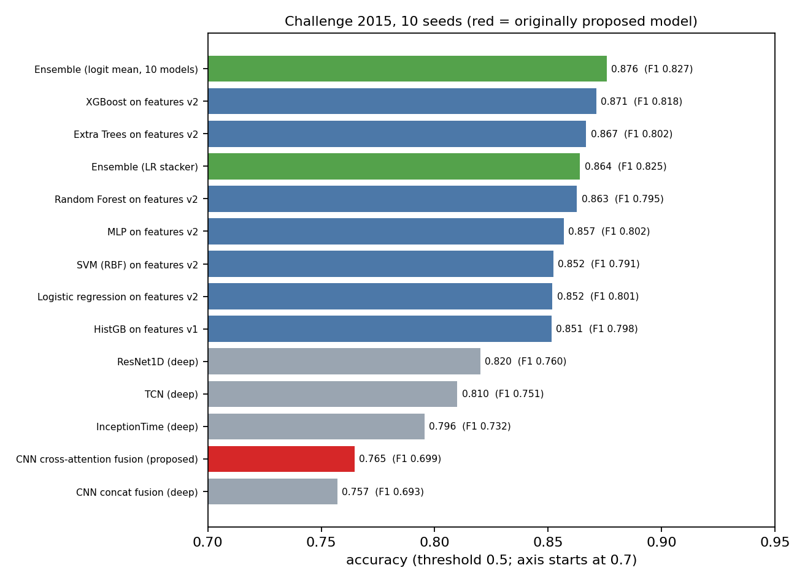
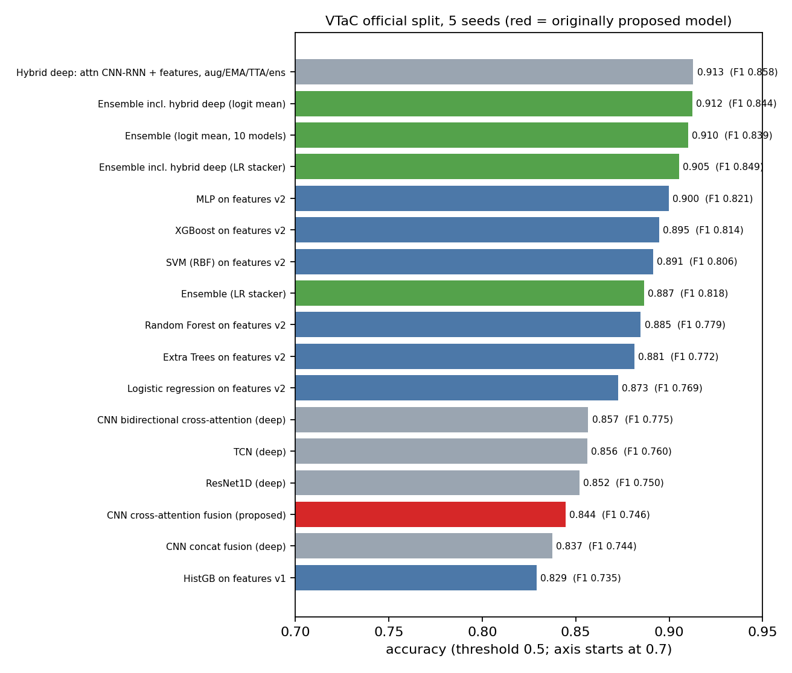
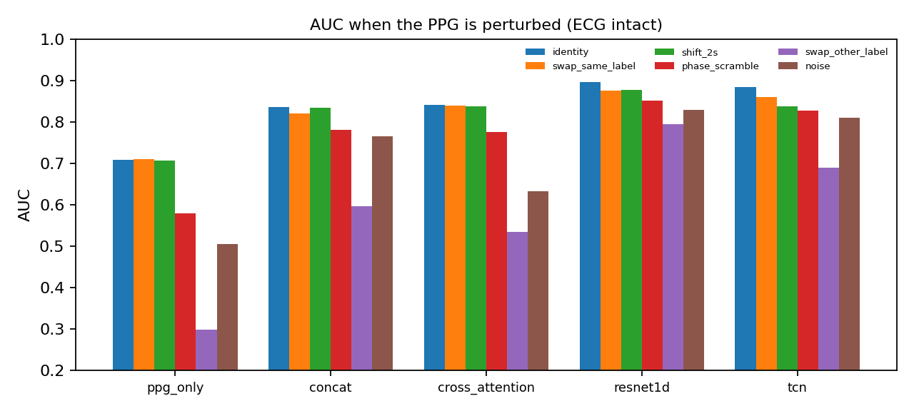
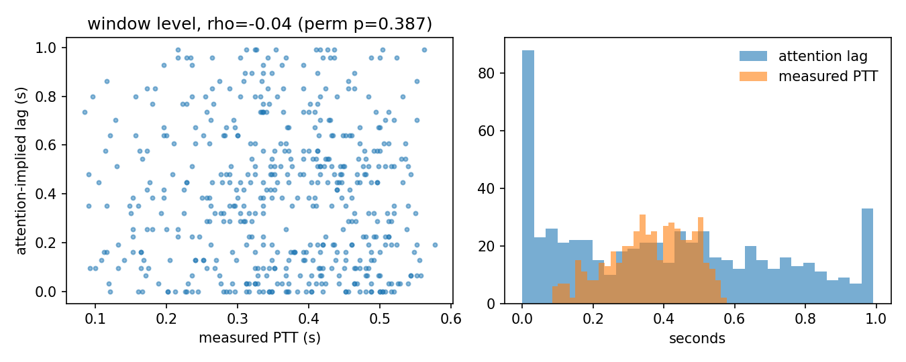
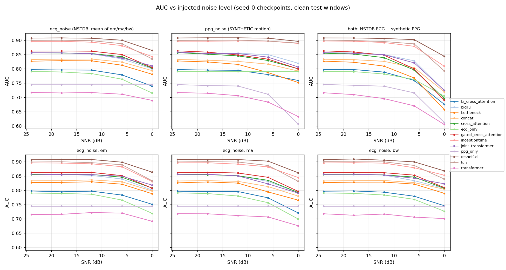
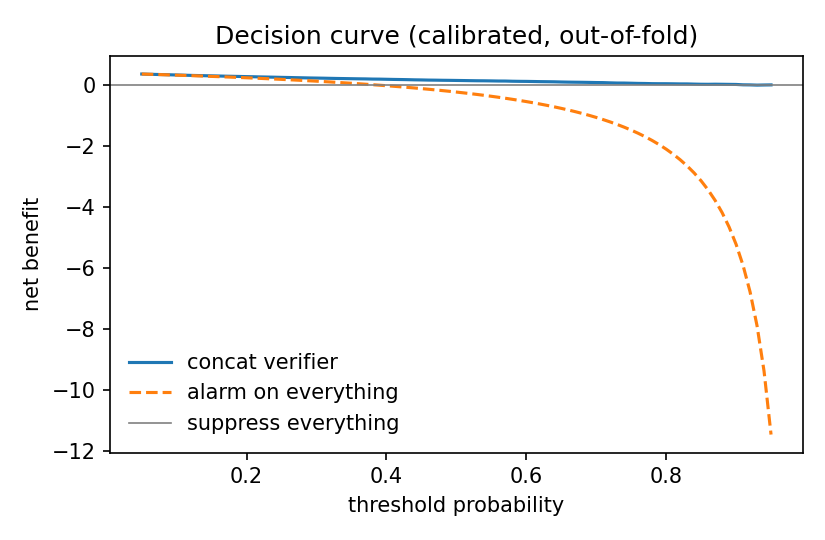

# Multimodal Cardiac Signal Verification: a controlled, leakage-audited, two-dataset study of ECG and pulse fusion for ICU alarm verification

*Research prototype. Not a medical device. No prospective validation. All results below are from the code in this repository; every figure and number is traceable to a file under `runs/` or `docs/`.*

## Abstract

**Background.** ICU bedside monitors raise many false arrhythmia alarms, causing alarm fatigue. Verifying an ECG-triggered alarm with an independent pulse signal (PPG or arterial pressure) is an attractive idea, and cross-attention fusion of the two signals was the starting hypothesis of this project.

**Methods.** We trained and compared 14 neural architectures, six classical algorithms on 266 engineered features, a hybrid deep recipe and cross-run ensembles on two open datasets: PhysioNet/CinC Challenge 2015 (750 records; 592-record PPG cohort and 724-record recovered cohort) and VTaC v1.1 (5,037 VT alarms; 4,542 usable; official patient-disjoint split). Inputs are the 10 s ending at the alarm onset. All hyperparameters, combiners and thresholds were fitted on inner validation sets; test folds were used once. Comparisons used a corrected resampled t-test, a paired record-level bootstrap and Holm correction over a family fixed in advance.

**Results.** Removing a validation leak in the original code lowered every score (cross-attention F1 0.774 to 0.699) and erased the advantage of cross-attention over concatenation (dF1 +0.006, 95% CI -0.015 to +0.028). Cross-attention ranks near the bottom of the leaderboard. The best models are a hybrid deep recipe (Challenge 2015: accuracy 0.871, F1 0.828, AUC 0.932; VTaC: accuracy 0.913, F1 0.858, AUC 0.966) and ensembles that include it (Challenge 2015: accuracy 0.878, F1 0.830, AUC 0.950). Counterfactual tests show that fused models do not use ECG-to-pulse timing, and attention weights do not track measured pulse transit time (rho = -0.04).

**Conclusions.** The pulse signal helps, but as a patient-agnostic evidence cue rather than a timing cross-check; careful engineering of features and training matters more than the fusion layer; and single-dataset numbers overstate generalisation in one direction (Challenge 2015 to VTaC transfers poorly, VTaC to Challenge 2015 transfers well).

---

## 1. Introduction

Most ICU monitors raise an arrhythmia alarm from the ECG alone. A large share of these alarms is false (electrode motion, muscle artifact), and the resulting alarm fatigue can delay the response to true alarms. A true arrhythmia should usually appear in both the electrical signal (ECG) and the mechanical pulse (PPG or arterial pressure), whereas an ECG artifact should not disturb the pulse. The project therefore asked whether a model that compares the two signals can verify alarms better than a model that sees one signal.

**Research questions** (from the scope-expansion plan, `updates.md`):

1. **Alignment.** Do fusion models actually use ECG-to-pulse temporal alignment, or only use the pulse as a quality cue?
2. **Label efficiency.** Does unlabeled paired data or a foundation model reduce the labels needed?
3. **Modalities.** Which signals add value and how gracefully does performance degrade when sensors drop out?
4. **Generalisation.** Do models transfer across datasets and sites?
5. **Safety.** Can the verifier suppress false alarms while keeping sensitivity high, and how reliable are its operating points?

VT alarms are the hardest case for false-alarm detection, which motivated adding the large VTaC dataset (about fifteen times more labeled VT alarms than the Challenge 2015 training set).

## 2. Related work and what is new

Attention-based and contrastive multimodal false-alarm reduction has been published (Mousavi et al., 2019, attention CNN/RNN on ECG, ABP and PPG; a 2022 Scientific Reports contrastive approach with alarm-type embeddings; feature-based methods with per-type suppression rates; Challenge 2015 rule-based entries). Open ECG and PPG foundation models (ECG-FM, PaPaGei) now exist. Cross-attention fusion alone is therefore not a novel contribution. The contribution of this work is evaluation rigor: a leakage audit of our own initial results, a pre-registered statistical family, counterfactual tests of what fusion models use, cross-dataset evaluation, and a controlled comparison against strong classical and deep baselines and published-method reproductions.

## 3. Data

Full details: `docs/datasheet.md`.

**PhysioNet/CinC Challenge 2015 (training set).** 750 ICU records, expert true/false label for one of five alarm types, alarm at 300 s, 250 Hz. Cohort flow: 627 records have PPG, 343 have ABP, all 750 have a second ECG lead. The original PPG cohort has 592 records (37.7% true alarms); substituting ABP where PPG is absent gives a recovered cohort of 724 records (39.6% true; 132 recovered via ABP; 26 excluded for near-total flat-line or too-short windows).

**VTaC v1.1.** 5,037 annotated VT alarm events from three US hospitals and three monitor manufacturers; at least two expert annotators per event; v1.1 releases per-annotator votes. We downloaded only the window `[onset - 60 s, onset + 30 s]` of each event (about 1 GB instead of 18 GB) using parallel HTTP range requests, because the host throttles each connection. After excluding 292 events without a pulse channel and 203 low-quality windows, 4,542 events remain (28.0% true alarms, 2,138 patients; official split train 3,662, val 453, test 427). Hospital and device identifiers are not released; the lead-set signature (two groups cover 60% and 26% of events) is used as an unverified device proxy.

**Decision-time windowing.** The headline task window is the 10 s that end exactly at the alarm onset; no post-alarm samples are used. The 30 s after the onset are read only by the time-to-verdict analysis.

**Other data.** MIT-BIH Noise Stress Test (synthetic noise injection), MIMIC PERform AF (35 subjects; AF screening), MIT-BIH Arrhythmia and BIDMC (detector validation). PulseDB, VitalDB and MIMIC-III were not available (access).

## 4. Methods

**Preprocessing.** Resample to 250 Hz, zero-phase Butterworth band-pass (ECG 0.5-40 Hz, pulse 0.5-8 Hz), per-window z-normalisation, a simple quality score per channel.

**Neural models (parameter-matched to about 261k parameters).**
- *Original ladder:* ECG-only and PPG-only 1D-CNN encoders, concatenation fusion, and the proposed cross-attention fusion (ECG queries, PPG keys/values, positional encodings, shallow head).
- *Fusion rivals:* bidirectional cross-attention, joint transformer with modality embeddings, bottleneck-token fusion, quality-gated cross-attention.
- *Baseline zoo (early fusion on a 2-channel input):* ResNet1D, InceptionTime, BiGRU, TCN, plain patch transformer, compact diagonal state-space model.
- *Multimodal model:* ECG lead 1, ECG lead 2, PPG and ABP as separate token sequences with modality embeddings, a masked joint transformer and modality dropout.

**Classical models.** 266 engineered features (HRV, ECG morphology proxies, wavelet and spectral features, PPG pulse features, ECG-PPG agreement such as PTT statistics and beat-count ratios in the last 5 s, signal-quality indices) with six algorithms: logistic regression, SVM (RBF), random forest, extra trees, XGBoost and an MLP, each with 30 random hyperparameter configurations per fold scored on the inner validation set; plus a stacker and an average.

**Hybrid deep recipe.** An attention CNN-GRU (Mousavi-style) with a pre-declared 48-configuration grid (6 architectures x augmentation x loss x learning rate) selected by inner-validation AUC only; augmentation (joint time shift, scaling, noise, modality dropout), focal loss, AdamW with a one-cycle schedule, EMA weights, test-time augmentation and a 3-member ensemble. Hand-crafted agreement features can be concatenated to the head (hybrid variants).

**Ensembles.** Logit mean, probability mean, logistic-regression stacker and greedy selection, each fitted on the inner-validation predictions of a fold only.

**Published-method reproductions.** A Mousavi-style attention CNN-RNN and an alarm-type contrastive variant; the faithfulness to the original papers is limited to what could be recalled (stated in the code).

**Self-supervised pretraining and foundation models.** Token-level contrastive, masked-reconstruction and cross-modal-prediction objectives on VTaC pre-alarm segments of train/val patients only; PaPaGei PPG foundation model (frozen, linear probe, last-block fine-tune).

## 5. Evaluation protocol

Full chapter: `docs/evaluation_protocol.md`.

* Record-wise 5-fold cross-validation for Challenge 2015, repeated for 10 seeds; the official patient-disjoint split for VTaC (5-10 seeds).
* An **inner record-wise validation set** (15% of the training records) drives early stopping, model selection, calibration, thresholds and combiner weights. The outer test fold is touched once.
* Metrics: accuracy, F1, AUC, sensitivity, specificity, the official Challenge 2015 score, and false alarms suppressed at a validation-chosen sensitivity of 95/99/100% with the realised test sensitivity always reported next to it.
* Statistics: Nadeau-Bengio corrected resampled t-test, paired record-level bootstrap (5,000 resamples), Holm correction over a comparison family fixed in `configs/config.yaml` before the final runs.

**Leakage audit of our own earlier results.** The original training script selected the best epoch and stopped training on the same fold it then reported. Fixing this lowered every score:

| Variant | F1 before | F1 after |
|---|---|---|
| PPG only | 0.660 | 0.602 |
| ECG only | 0.736 | 0.642 |
| Concatenation | 0.750 | 0.693 |
| Cross-attention | 0.774 | 0.699 |

The cross-attention advantage over concatenation shrank from +0.024 to +0.006. The original results are archived in `runs/legacy_pre_fix/` and should not be cited.

## 6. Results

### 6.1 Challenge 2015 leaderboard (10 seeds)

| Model | Group | Accuracy | F1 | AUC |
|---|---|---|---|---|
| Ensemble (logit mean, 10 models) | ensemble | 0.876 | 0.827 | 0.948 |
| XGBoost on features v2 | classical | 0.871 | 0.818 | 0.939 |
| Extra Trees on features v2 | classical | 0.867 | 0.802 | 0.947 |
| Random Forest on features v2 | classical | 0.863 | 0.795 | 0.938 |
| MLP on features v2 | classical | 0.857 | 0.802 | 0.927 |
| SVM (RBF) on features v2 | classical | 0.852 | 0.791 | 0.928 |
| Logistic regression on features v2 | classical | 0.852 | 0.801 | 0.928 |
| Gradient boosting on features v1 | classical | 0.851 | 0.798 | 0.918 |
| ResNet1D | deep | 0.820 | 0.760 | 0.884 |
| TCN | deep | 0.810 | 0.751 | 0.887 |
| InceptionTime | deep | 0.796 | 0.732 | 0.876 |
| CNN cross-attention (proposed) | deep | 0.765 | 0.699 | 0.841 |
| CNN concatenation | deep | 0.757 | 0.693 | 0.836 |

With 5 seeds, the hybrid deep recipe reaches accuracy 0.875, F1 0.832 (10-seed run: 0.871 / 0.828 / 0.932) and the ensemble including it accuracy 0.878, F1 0.830, AUC 0.950 (stacker: F1 0.839, sensitivity 0.870). The ensemble's F1 advantage over the best classical model is within noise (+0.008, CI -0.007 to +0.022) but over cross-attention it is +0.128 (CI +0.094 to +0.161).

### 6.2 VTaC leaderboard (official split, 5 seeds)

| Model | Group | Accuracy | F1 | AUC |
|---|---|---|---|---|
| Hybrid deep recipe | deep | 0.913 | 0.858 | 0.966 |
| Ensemble incl. hybrid (logit mean) | ensemble | 0.912 | 0.844 | 0.957 |
| Ensemble (10 models, logit mean) | ensemble | 0.910 | 0.839 | 0.955 |
| MLP on features v2 | classical | 0.900 | 0.821 | 0.949 |
| XGBoost on features v2 | classical | 0.895 | 0.814 | 0.942 |
| SVM (RBF) on features v2 | classical | 0.891 | 0.806 | 0.948 |
| CNN bidirectional cross-attention | deep | 0.857 | 0.775 | 0.933 |
| TCN | deep | 0.856 | 0.760 | 0.919 |
| ResNet1D | deep | 0.852 | 0.750 | 0.915 |
| CNN cross-attention (proposed) | deep | 0.844 | 0.746 | 0.915 |
| CNN concatenation | deep | 0.837 | 0.744 | 0.909 |

On VTaC, fusion helps: ECG-only reaches F1 0.709 and PPG-only 0.566, against 0.744 for concatenation. The gap between the hybrid recipe and the original cross-attention model is +0.11 F1 (CI +0.07 to +0.15). Differences among the top three models are inside bootstrap noise.

**Caveat on the hybrid recipe.** Its configuration was chosen on inner-validation scores of Challenge 2015 folds; those records are test records in other seeds and folds, so a small optimistic bias is possible. A shuffled-label control gave chance-level AUC (0.57) and no leakage was found. The VTaC test split contains 427 events (not the 482 events of the unfiltered official split).

### 6.3 Pre-registered comparisons (Challenge 2015, F1 difference challenger minus baseline)

| Baseline | Challenger | dF1 | Bootstrap 95% CI | Reading |
|---|---|---|---|---|
| concat | cross-attention | +0.006 | -0.015 ... +0.028 | not different |
| ECG-only | cross-attention | +0.057 | +0.028 ... +0.088 | fusion helps |
| PPG-only | cross-attention | +0.096 | +0.058 ... +0.129 | fusion helps |
| cross-attention | bidirectional | -0.008 | -0.023 ... +0.008 | not different |
| cross-attention | joint transformer | -0.007 | -0.025 ... +0.013 | not different |
| cross-attention | gated | -0.001 | -0.015 ... +0.012 | not different |
| cross-attention | bottleneck | -0.047 | -0.070 ... -0.026 | worse |
| cross-attention | ResNet1D | +0.061 | +0.035 ... +0.087 | ResNet1D better |
| cross-attention | gradient boosting (features v1) | +0.100 | +0.066 ... +0.133 | GBM better (Nadeau-Bengio p = 0.003) |

(For rows where the challenger is the better model the sign is that of challenger minus baseline.) The Nadeau-Bengio test is more conservative than the bootstrap, as expected; a finding is called robust only where both tests agree after Holm correction.

### 6.4 Per alarm type and calibration

Per alarm type (cross-attention, pooled out-of-fold): Asystole F1 0.41 (14 true of 93), Bradycardia 0.75, Tachycardia 0.92 (but specificity only 0.42), Ventricular Flutter/Fibrillation 0.26 (5 true of 45) and Ventricular Tachycardia 0.49 (59 true of 270). Asystole and VF/Flutter have too few true alarms for reliable conclusions. In the error taxonomy (`docs/error_taxonomy.md`), persistent missed true alarms are dominated by VT (18 of 29 persistent FN for the feature GBM, although VT is only 26% of true alarms).

## 7. Analysis: what do the models use?

Consolidated in `docs/analysis_findings.md`.

### 7.1 Counterfactual alignment tests

One modality is perturbed while the other is intact (seed-0 checkpoints, 5 test folds).

* Replacing the PPG with another patient's same-label PPG (real waveform, unrelated timing) changes AUC by 0.00-0.03 for every model (cross-attention 0.002, concat 0.015, ResNet1D 0.021, TCN 0.024).
* Circular shifts up to 2 s change AUC by at most 0.005 for the CNN fusion models and by 0.03-0.06 for ResNet1D, TCN, InceptionTime and BiGRU.
* Replacing the pulse with an opposite-label pulse collapses AUC (cross-attention 0.842 to 0.535); pure noise costs 0.07-0.21.

The models use the *content* of each signal (morphology, regularity, presence) as evidence, not the relative timing of ECG beats and pulses. The pulse-transit-time justification in the original proposal is not supported.

### 7.2 Attention versus measured pulse transit time

Attention-implied lag versus measured PTT (R-peak to PPG foot): window-level Spearman rho = -0.039 (permutation p = 0.39), beat-level rho = 0.017; attention mass in the physiological lag range is 5.3%, versus 5.6% for uniform attention.

### 7.3 Explanation faithfulness

Deletion/insertion curves over 0.5 s blocks (paired difference against random ordering): occlusion is clearly faithful (PPG deletion -0.041, insertion +0.041), integrated gradients modestly (-0.016 / +0.010), and the attention weights barely better than random (-0.007 / +0.011). Attention weights should not be presented as an explanation.

### 7.4 Which signals matter (modality subsets)

On the 191 recovered-cohort windows with all four sensors, AUC rises from 0.70-0.73 with a single sensor to 0.82 with all four. Shapley contributions to AUC above chance: ECG 0.102, second ECG lead 0.089, PPG 0.073, ABP 0.058 (confidence intervals about +-0.07).

### 7.5 Robustness to noise and sensor loss

Real NSTDB noise on the ECG and synthetic motion artefact on the PPG at 24 to 0 dB SNR: ResNet1D is the most robust (mean AUC drop 0.011 over the grid; 0.907 clean to 0.844 at 0 dB on both signals), whereas cross-attention falls from 0.856 to 0.696 and concat from 0.833 to 0.720 at 0 dB on both signals. Constant PPG delays of 0-400 ms barely change the CNN fusion models (consistent with 7.1). Zeroing the PPG at inference (no retraining) costs cross-attention 0.12 AUC (0.856 to 0.736), concat 0.10 and ResNet1D 0.27 (0.907 to 0.634); zeroing the ECG costs cross-attention 0.08. A check that the injected noise is not a learnable shortcut gave AUC 0.52-0.55 from model probabilities alone.

### 7.6 Generalisation across datasets

| Train to test | ECG-only | PPG-only | concat | cross-attn | ResNet1D | TCN |
|---|---|---|---|---|---|---|
| Challenge 2015 to VTaC test (F1 / AUC) | 0.603 / 0.776 | 0.432 / 0.541 | 0.571 / 0.734 | 0.577 / 0.762 | 0.556 / 0.773 | 0.563 / 0.782 |
| VTaC to Challenge 2015 VT alarms (F1 / AUC) | 0.682 / 0.881 | 0.529 / 0.774 | 0.673 / 0.864 | 0.669 / 0.868 | 0.773 / 0.927 | 0.738 / 0.911 |

Transfer is strongly asymmetric: models trained on the small Challenge 2015 set transfer poorly to VTaC (PPG-only is near chance), whereas models trained on VTaC transfer well to Challenge 2015 VT alarms. For comparison, cross-attention trained and tested within Challenge 2015 reaches VT F1 0.49 on the per-type table, so more training data matters more than the model family.

## 8. Label efficiency, pretraining and foundation models

* **Self-supervised pretraining + fine-tuning** (three objectives, label fractions 10-100%, 3 seeds): modest paired gains over scratch (+0.01 to +0.04 F1, largest for the single-signal models); frozen encoders are worse than scratch for fusion models. Only 1 of 72 paired contrasts has a Nadeau-Bengio p < 0.05, so the effect is suggestive, not established. Single-signal models use width 1.0 in both arms because width-matched models cannot load width-1.0 pretrained weights.
* **PaPaGei foundation model** (code BSD-3-Clause-Clear; the Zenodo weights record sets no licence): frozen features plus a linear probe reach F1 0.58 (PPG alone), below the from-scratch PPG encoder in F1 though AUC is on par; the best PaPaGei fusion model is about 0.04 F1 below scratch cross-attention. On VTaC, PaPaGei beats scratch PPG-only (0.58-0.62 versus 0.566) but not scratch fusion (0.745). ECG-FM weights were downloaded but not run (needs a C/C++ compiler for fairseq-signals and 12-lead 500 Hz input).
* **Larger corpora** (PulseDB, VitalDB, MIMIC-III) were not available; they remain the most promising route to better pretraining.

## 9. Supporting results

* **Multitask auxiliary heads** (alarm type, per-channel quality, beat positions): the auxiliary tasks are learned on held-out folds (type accuracy 0.62, beat-token F1 0.70) but have no effect on alarm verification (F1 0.709 versus 0.709, Nadeau-Bengio p = 0.998): no interference and no benefit.
* **Beat detection:** the R-peak detector reaches F1 0.965 on 10 MIT-BIH records (150 ms tolerance); the quality head is trained on pseudo-labels (no human annotation exists).
* **Published-method reproduction audit:** the attention CNN-RNN loses 0.040 F1 when the test-fold early stopping used by a typical original protocol is replaced by the strict protocol, essentially all of it from epoch selection on the test fold (random split with an inner validation set versus the strict split: -0.003).
* **AF screening** (MIMIC PERform AF, 35 subjects, subject-wise CV; low power): an RR-irregularity gradient-boosting model scores subject-level AUC 1.00, significantly better than the best neural model (0.93); fusion beats PPG-only by +0.28 subject AUC; a PPG-only student distilled from the fusion teacher is indistinguishable from PPG-only trained on hard labels.
* **Label reliability** (VTaC per-annotator votes): 7.7% of events have split votes; accuracy is much lower on them (cross-attention 0.704 versus 0.854); model entropy tracks disagreement only weakly (Spearman 0.13-0.18). Training on annotator vote fractions improves cross-attention by +0.038 F1 (SD 0.012, 5 seeds).
* **Time-to-verdict:** with a 10 s window ending 0/5/10/30 s after the onset, F1 falls (cross-attention 0.740, 0.713, 0.515, 0.451). This slides the window away from the triggering event, so it is not evidence that waiting helps; a window keeping the pre-alarm 10 s and appending post-alarm seconds was not run.

## 10. Clinical utility and safety

A safety layer (`src/safety.py`) provides temperature calibration, a risk-controlled suppression threshold with an exact Clopper-Pearson bound on the miss rate, a deferral band and utility rates per 100 alarms. It abstains when the validation set has too few true alarms to certify the target, and this happens: for the concat model, a 10% miss tolerance at 90% confidence could be certified in only 42 of 50 folds, suppressing 22.5% of false alarms while missing 2.9% of true alarms, and calibration reduced ECE from 0.167 to 0.121. Validation-chosen thresholds aimed at 95-100% sensitivity realised about 92-97% sensitivity on test folds, so *sensitivity targets must not be assumed to transfer*. The safety analysis was run only for the concat model; alarm volume per bed-day is a user-supplied assumption, not data.

## 11. Limitations and ethics

* **Small data and noise.** 592/724 Challenge 2015 records; fold-to-fold SD of F1 about 0.05; many differences between top models are inside noise.
* **Domain knowledge in features.** Several engineered features and, on Challenge 2015, the alarm type itself encode the alarm definitions; this is not learned physiology and was not ablated.
* **Selection bias risk** for the hybrid recipe (6.2).
* **Missing pieces.** No prospective validation; US ICU data only; demographic and skin-tone effects on optical PPG not assessed; VTaC hospital/device identifiers not released (proxy unverified); patient overlap between corpora cannot be checked; the safety layer was run only for concat.
* **Not run.** Leave-one-device-out (code exists), long pre-alarm context, alarm-type conditioning, a time-to-verdict window that keeps the pre-alarm context, ECG-FM, and pretraining on PulseDB/VitalDB/MIMIC-III.
* **Ethics.** Public de-identified data under the sources' IRB approvals; the model must not be used to suppress alarms unsupervised.

## 12. Conclusion

The originally proposed cross-attention model is not better than naive concatenation and is clearly beaten by simpler or better-engineered approaches. The signals are complementary (fusion beats either signal alone on both datasets), but models exploit the content of each signal rather than the beat-to-pulse timing that motivated the design. The best leak-free results come from engineered features, a carefully trained hybrid deep model and ensembles (accuracy 0.878-0.913, F1 0.83-0.86). The most important methodological lesson is that an unnoticed validation leak had inflated the headline result by 0.075 F1; the controlled protocol in this repository is what makes the remaining conclusions trustworthy. The next steps with the highest expected value are larger unlabeled pretraining corpora (pending data access), leave-one-site-out evaluation, and prospective validation.

## Appendix A. Reproduction

See `README.md` (pipeline commands), `docs/evaluation_protocol.md`, `docs/LEADERBOARD.md` (full tables with bootstrap confidence intervals), `docs/updates_status.md` (item-by-item status), `docs/model_card.md` and `docs/tripod_ai_checklist.md`. All 49 unit tests pass (`python -m pytest tests`).

## Appendix B. Compute

One workstation GPU (RTX PRO 4000 Blackwell, 24 GB) and 20 CPU cores; neural folds train in seconds to minutes. Large downloads were obtained with parallel HTTP range requests (`scripts/download_vtac.py`) because the host throttles each connection to about 30 KB/s.
